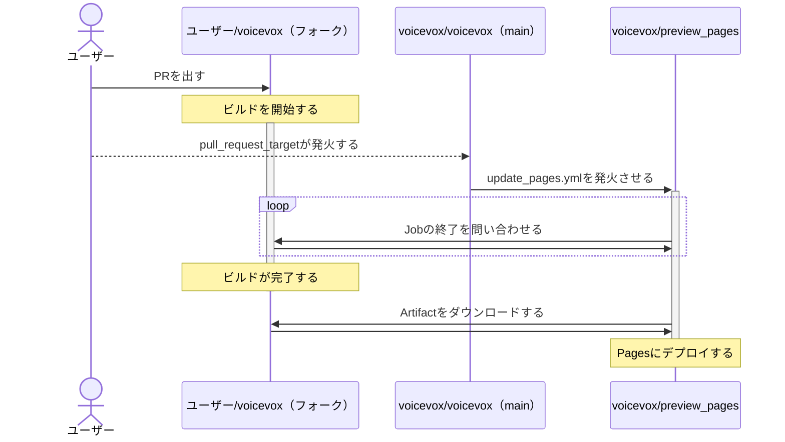

# VOICEVOX Preview Pages

[voicevox/voicevox](https://github.com/voicevox/voicevox) のプレビューページを提供するためのリポジトリです。  
対象ブランチ：

- `main`
- `project-*`
- プルリクエスト

## 動かす

### Webサーバーだけ動かす場合

以下のコマンドを実行します：

```
pnpm i
curl https://voicevox.github.io/preview-pages/preview/downloads.json -o ./public/preview/downloads.json
pnpm run dev
```

### コメントの追加などの書き込み系の動作なしで動かす場合

1. GitHub の Personal Access Token を取得します。
2. `.env.example` をコピーして `.env` を作成します。内容はコメントを参照してください。
3. 以下のコマンドを実行します：

```
pnpm run run:collect-artifacts
```

### 書き込み系の動作を含めて動かす場合

1. GitHub Appsを作成します。

権限は以下の通りです：

- Pull requests：Read & write

#### Actionsで動かす

2. 作成したGitHub Appsの`Private key`を取得し、リポジトリの`Settings` > `Secrets` に`PRIVATE_KEY`として保存します。
3. `.env.example` の内容をリポジトリの`Settings` > `Secrets` にキーごとに保存します。

#### ローカルで動かす

2. 作成したGitHub Appsの`Private key`を取得し、`private-key.pem`として保存します。
3. `.env.example` をコピーして `.env` を作成します。内容はコメントを参照してください。
4. 以下のコマンドを実行します：

```
pnpm run run:collect-artifacts
pnpm run run:update-comments
```

## 仕組み



## リポジトリの追加

1. `scripts/constants.ts` を編集します。

設定例：

```ts
  blog: {
    repo: "VOICEVOX/voicevox_blog",
    label: "ホームページ",
    links: [
      {
        path: "index.html",
        buttonType: "success",
        emoji: ":house:",
        label: "ホームページ",
      },
    ],
  },
```

2. 追加するリポジトリに以下の2つのWorkflowを追加します。

<details>
<summary>DANGEROUS_trigger_preview_pages.yml</summary>

```yaml
name: "Trigger preview-pages' workflow"

# プレビュー用ページのワークフローを起動する。
# 詳細： https://github.com/voicevox/preview-pages?tab=readme-ov-file#%E4%BB%95%E7%B5%84%E3%81%BF

on:
  pull_request_target:
    types:
      - opened
      - synchronize
      - closed
      - reopened
  push:
    branches:
      - main
      - project-*

jobs:
  trigger:
    runs-on: ubuntu-latest
    if: github.repository_owner == 'VOICEVOX'
    steps:
      - name: Trigger Workflow
        run: |
          gh workflow run -R voicevox/preview-pages update_pages.yml
        env:
          GH_TOKEN: ${{ secrets.TRIGGER_PREVIEW_PAGES_TOKEN }}
```

</details>
<details>
<summary>build_preview_pages.yml</summary>

```yaml
name: "Build Preview Pages"

# プレビュー用ページをビルドする。
# 詳細： https://github.com/voicevox/preview-pages?tab=readme-ov-file#%E4%BB%95%E7%B5%84%E3%81%BF

on:
  push:
    branches:
      - main
      - project-*
  pull_request:

jobs:
  # このJobの名前を変更したときは、voicevox/preview-pages側のscripts/collect.tsも変更すること。
  build_preview_pages:
    runs-on: ubuntu-latest
    steps:
      # ... 環境構築 ...

      - name: Determine base URL
        id: determine_base_url
        uses: VOICEVOX/preview-pages/base@main
        with:
          name: blog

      # このStepは適宜変更すること。
      - name: Build
        run: |
          pnpm run build --base ${{ steps.determine_base_url.outputs.base_url }}

      - name: Upload artifact
        uses: actions/upload-artifact@v4
        with:
          name: preview-pages
          # pathも適宜変更すること。
          path: "./dist"
```

## ライセンス

[LICENSE](LICENSE) を参照してください。
